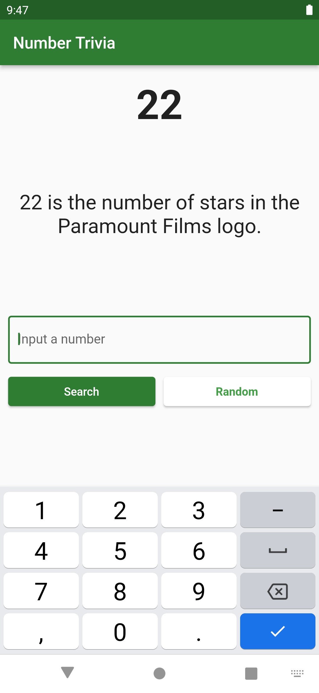

# Number Trivia App

This application was built based on the [Flutter TDD Clean Architecture](https://www.youtube.com/playlist?list=PLB6lc7nQ1n4iYGE_khpXRdJkJEp9WOech) course, created by [Reso Coder](https://www.youtube.com/c/ResoCoder).

The application consists in a textfield that, after filled with a positive number, will show a trivia about the given number.

It's an simple app, but it's construction ensures a good knowledge of TDD and Clean Architecture.

